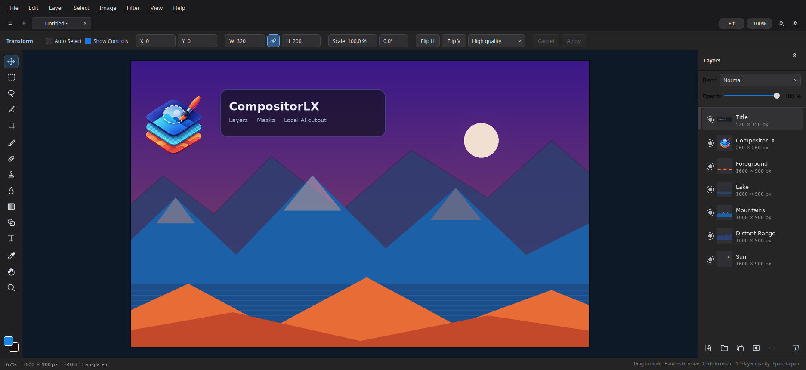
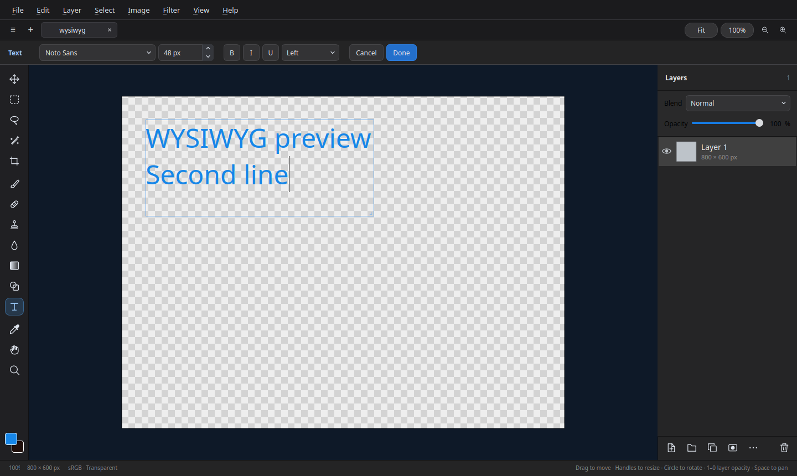

<p align="center">
  
</p>

<h1 align="center">CompositorLX</h1>

<p align="center">
  <b>A native Linux image compositor</b> with layers, masks, and Photoshop-style tools.<br>
  Qt 6 port of <a href="https://github.com/robbietilton/Compositor">Compositor</a> — free, local, and built for compositing.
</p>

<p align="center">
  
  
  
  
</p>

<p align="center">
  
</p>

CompositorLX is a full-featured raster editor for Linux: layered `.comp` projects, non-destructive transforms, painting and retouching, live adjustment layers, and a local Remove Background model. No account, no cloud round-trip for subject cutouts.

## Features

### Layers
- Layers and folders with blend modes, opacity, visibility swipe, and inline rename
- Layer masks you can paint, fill, invert, link, unlink, and transform on their own
- Clipping stacks and folder masks
- Live adjustment layers: Hue/Saturation, Levels, Curves, Exposure, Gradient Map, Grain
- Merge down / selection / group, flatten, duplicate, and drag layers between project tabs

### Transform
- Non-destructive move, scale, rotate, and flip — source pixels keep their resolution
- Free-corner distortion, multi-layer and folder transforms, snapping guides
- Numeric position, size, scale, and rotation with keyboard nudging
- Flip layer or canvas, horizontally and vertically

### Selections
- Rectangular and elliptical marquee, freehand and polygonal lasso, magic wand
- Add / subtract / intersect, move the outline, or move and duplicate the pixels inside
- Load a layer’s pixels or a mask as a selection
- Content-aware fill, including extending past a layer’s edges

### Painting and retouching
- Brush and eraser with size, hardness, opacity, and Shift for straight lines
- Spot healing brush and clone stamp (aligned or not, this layer or all layers)
- Blur, gradient, and shape tools (rectangle, rounded rectangle, ellipse)
- Live WYSIWYG text, eyedropper with sample ring, and a persistent color picker

<p align="center">
  
</p>

### Adjustments and filters
- Levels (with Auto), Curves, Hue/Saturation, Exposure, Gradient Map, Grain, Invert
- Gaussian blur and motion blur that spread past a layer’s edges
- Add noise, lens correction, and **Remove Background** — local ONNX + U²-Net, no web service
- Live previews, limited to the selection when one exists

### Canvas and files
- Multiple projects in tabs, with cross-tab layer copy and recovery
- Crop with snapping and Alt symmetry, plus Canvas Size and Image Size
- Sharp downsampling when zoomed out, optional pixel grid when zoomed in
- Import PNG, JPEG, TIFF, and HEIC/HEIF; export PNG and JPEG with sRGB rasterization
- Photoshop-style shortcuts, autosave, and atomic Save / Save As

## Install

Download an [AppImage or Debian package](https://github.com/ClaudiuJitea/compositorLX/releases) and run:

```sh
chmod +x CompositorLX-0.1.0-x86_64.AppImage
./CompositorLX-0.1.0-x86_64.AppImage
```

Or install the `.deb` on Debian/Ubuntu:

```sh
sudo apt install ./compositorlx_0.1.0_amd64.deb
compositor-lx
```

You can also build packages locally:

```sh
./packaging/build-packages.sh
```

Finished files land in `artifacts/`. Packages include the executable, the local subject-removal runtime and model, a freedesktop launcher, AppStream metadata, a HiDPI icon set (16×16 through 1024×1024), and third-party license texts.

## Build from source

**Ubuntu / Debian**

```sh
sudo apt install qt6-base-dev qt6-image-formats-plugins libheif-dev cmake ninja-build
```

```sh
cmake -S . -B build -G Ninja -DCMAKE_BUILD_TYPE=Release
cmake --build build
./build/compositor-lx [path/to/project.comp]
```

The first configure downloads checksum-pinned ONNX Runtime and the U²-Net model. Remove Background always runs on the local machine.

Install into a prefix:

```sh
cmake --install build --prefix "$HOME/.local"
```

## Project layout

| Path | What it is |
| --- | --- |
| `src/core` | Document, history, and editor commands |
| `src/io` | `.comp` v1–v7 reader/writer, import, export |
| `src/rendering` | Compositing, caches, filters, local subject removal |
| `src/ui` | Qt Widgets editor, canvas, layers, tools |
| `packaging/` | Desktop entry, AppStream metadata, icons, package script |
| `vendor/compositor-rendering/` | Shared pixel kernels from the macOS editor |

The original macOS app remains the behavior and file-format reference. Linux-specific UI and packaging live in this repository.

## License

MIT. CompositorLX is a Linux port of [Compositor](https://github.com/robbietilton/Compositor) by Wonder Assembly LLC. Pixel kernels under `vendor/compositor-rendering/` come from that project. ONNX Runtime and U²-Net keep their own license files in packaged builds.
